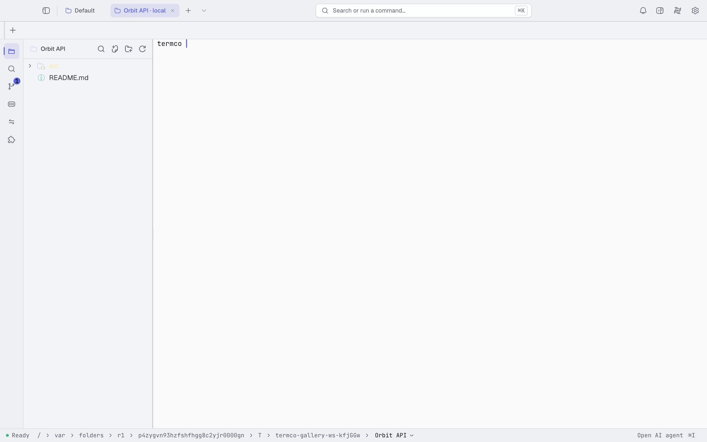
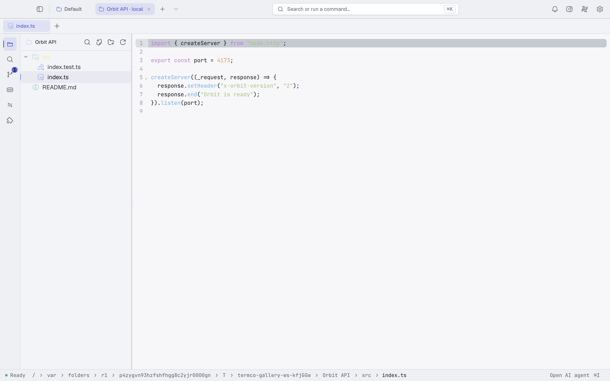
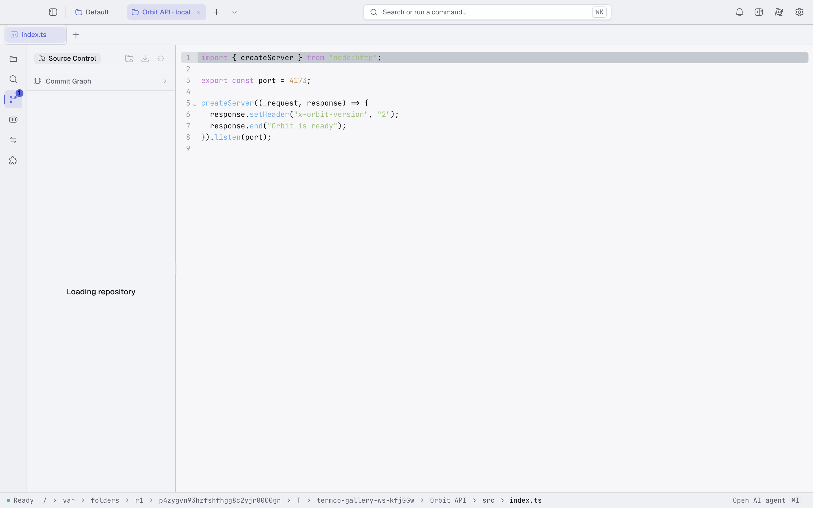
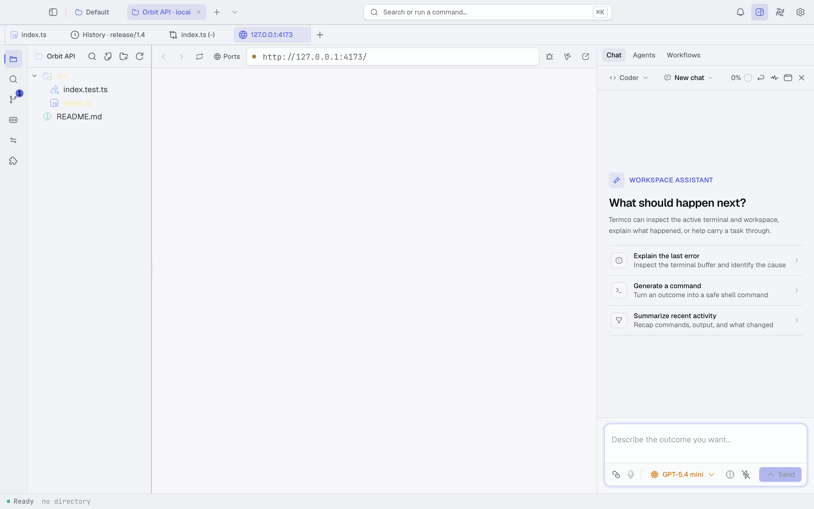
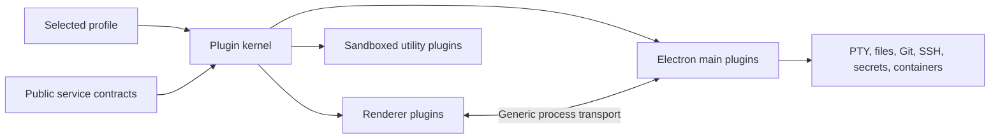

<div align="center">
  

# Termco

**A terminal-first, AI-native development workspace.**

[](LICENSE)
[](https://www.electronjs.org/)
[](https://www.typescriptlang.org/)
[](#platform-support)

Terminal, editor, source control, local preview, remote workspaces, containers,
and agentic tools in one private, extensible desktop application.

[Features](#features) · [Quick start](#quick-start) · [Architecture](#architecture) · [Development](#development) · [Plugin authoring](#plugin-authoring) · [Community](#community)

</div>

---

Termco is an open-source development environment built around the terminal rather than around a file editor. It combines a native PTY, code editing, file navigation, Git workflows, local web previews, remote rigs, container tools, and an AI work surface without requiring a Termco account or telemetry.

Developers retain control over their models, provider credentials, project data, tools, and approval policy. Hosted inference works with user-supplied credentials and compatible endpoints; local runtimes can keep inference on the developer's machine.

> **Project status:** Termco is currently in public beta. The first release line
> is `0.9.x`; compatibility and extension APIs may still evolve before `1.0.0`.

## Community

- [Share a product idea](https://github.com/termco-ai/termco/discussions/categories/ideas)
- [Propose a plugin](https://github.com/termco-ai/termco/discussions/categories/plugin-ideas)
- [Ask the community a question](https://github.com/termco-ai/termco/discussions/categories/q-a)
- [Report an application or plugin bug](https://github.com/termco-ai/termco/issues/new/choose)
- [Read the contribution guide](.github/CONTRIBUTING.md)

Please report security vulnerabilities privately through
[GitHub Security Advisories](https://github.com/termco-ai/termco/security/advisories/new),
not through a public issue or discussion.

## Product tour

<table>
  <tr>
    <td width="50%" align="center">
      
      <br /><sub>Terminal-first workspace with persistent navigation</sub>
    </td>
    <td width="50%" align="center">
      
      <br /><sub>Integrated editor and project navigation</sub>
    </td>
  </tr>
  <tr>
    <td width="50%" align="center">
      
      <br /><sub>Source control, staging, diffs, and commit history</sub>
    </td>
    <td width="50%" align="center">
      
      <br /><sub>Reviewable AI-assisted development workflow</sub>
    </td>
  </tr>
</table>

## Why Termco?

- **Terminal first:** shells, commands, and long-lived processes remain the center of the workspace.
- **One development surface:** move between files, code, Git, previews, ports, containers, and AI-assisted work without changing applications.
- **Developer controlled:** use hosted or local inference, keep credentials in the operating-system keychain, and approve sensitive tool actions explicitly.
- **No required account or telemetry:** Termco does not require a hosted Termco identity and does not collect product telemetry.
- **Plugin owned:** product features are independently owned plugins with explicit contracts, dependencies, lifecycle, and replacement behavior.
- **Cross-platform:** the same workspace model targets macOS, Linux, and Windows, including Windows shell and WSL workflows.

## Features

| Area | Capabilities |
| --- | --- |
| Terminal | Native PTY sessions, WebGL rendering, multiple tabs, split panels, background streaming, search, links, true color, and shell-aware environments |
| Editor | CodeMirror-based editing, language support, Vim mode, inline completions, reviewable edit diffs, and independent editor themes |
| Files and search | Explorer navigation, fuzzy search, keyboard workflows, rename and context actions, project-wide search, and direct attachment to AI work |
| Source control | Working-tree status, hunk staging, commits, branch state, synchronization actions, searchable history, and a lane-based commit graph |
| Preview and ports | Local server discovery, embedded previews, external URL surfaces, port inspection, and forwarded remote services |
| AI workspace | Chat, plans, tools, approvals, retries, compaction, session history, trajectories, forks, agents, workflows, and model selection |
| Remote development | SSH-backed rigs, remote files and terminals, remote container access, port forwarding, and supervised remote agent runs |
| Containers | Local and remote discovery, inspection, lifecycle actions, logs, ports, and container-backed development workflows |
| Customization | Light and dark themes, custom colors and backgrounds, shortcuts, editor settings, model sources, and plugin profiles |
| Extensibility | Source-owned plugins, public service contracts, reversible contributions, dependency-aware activation, live replacement, and sandboxed process boundaries |

## Quick start

### Prerequisites

| Requirement | Version or notes |
| --- | --- |
| Node.js | `22` or newer |
| pnpm | `11.9.0` recommended; the repository pins its package-manager version |
| Git | Required for source-control features and development |
| Native toolchain | Xcode Command Line Tools on macOS, a C/C++ build toolchain on Windows, or standard build tools on Linux may be required for native dependencies |

After cloning the repository:

```bash
git submodule update --init --recursive
pnpm install --frozen-lockfile
pnpm dev
```

Termco pins both its modified Wterm fork and the canonical official-plugin
source repository as Git submodules. `pnpm dev`, `pnpm build`, `pnpm test`, and
`pnpm check-types` bootstrap the required Wterm packages when the pinned
revision changes. The normal application build compiles only the seven bundled
core plugins; feature-plugin compilation and tests run through the separate
compatibility commands. `pnpm dev` starts the renderer and Electron development
processes with hot reload. Application data created by a normal run is stored
in the platform-specific Electron user-data directory, not in the repository.

To build and launch the production output locally:

```bash
pnpm build
pnpm start
```

## Configuration

### AI and model sources

1. Open **Settings** and navigate to the model-source section.
2. Choose a hosted provider, a compatible endpoint, or a local runtime.
3. Enter connection details and select a model.
4. Review the tool and approval policy before starting agentic work.

Provider secrets are stored through the operating-system keychain. They must not be written to repository files, application settings, browser storage, or session logs.

### Local inference

Local runtimes can expose a compatible HTTP endpoint on the developer machine. Configure the endpoint in Settings, verify connectivity, and select one of the models reported by that runtime. Availability and model capabilities depend on the runtime and hardware.

### Remote rigs

Remote workspaces use SSH configuration and explicit connection details. Termco can project remote files, terminals, containers, and forwarded ports into the same workspace. Test a host with the system SSH client first when diagnosing authentication or network failures.

## Architecture

Termco is an Electron application with a React 19 renderer, a native `node-pty` backend, and a small plugin kernel shared across renderer and main-process concerns.



The current source tree contains 152 source-owning plugins. Base packages publish service and contribution contracts; provider plugins implement them; consumer plugins depend on contracts rather than on provider source. A selected profile defines the active graph and activation order.

Important properties:

- registrations and effects are reversible on plugin deactivation;
- shared services have one selected provider while registries accept multiple contributions;
- renderer and main-process communication uses generic transport rather than feature-specific host dispatch;
- profile replacement validates and settles a candidate graph before it becomes active;
- native filesystem, process, network, Git, secret, and tool boundaries validate inputs;
- source plugins compile into disposable caches, leaving their editable source intact.

### Application and plugin updates

Termco has two deliberately separate release lanes. Changes to the Electron
host, protected platform plugins, native dependencies, or public base contracts
ship through the signed application installer and `electron-updater`. Compatible
ordinary plugins can ship as a separately signed atomic set, activate through
the existing live-replacement transaction, and normally require no restart.

Plugin releases use the separate
[`termco-ai/termco-plugin-releases`](https://github.com/termco-ai/termco-plugin-releases)
source and GitHub Releases repository. A packaged installation contains only
public contracts and seven recovery-critical core plugins. On first launch it
shows the setup screen, downloads the current signed 100-plugin snapshot,
enforces application compatibility, verifies the archive digest, compiles the
complete set in staging, and only then opens the workspace. Later starts check
both application and plugin feeds once; compatible plugin updates can activate
without replacing Electron. Personal plugin sources are never overwritten. A
full application release takes precedence over equal or older independently
installed plugin generations, and a publisher revocation restores the previous
profile.

See the [interactive update architecture](docs/plugin-update-overview.html) for
the decision matrix, protected set, release topology, and operational flow. The
[plugin release setup checklist](docs/plugin-release-setup.html) walks through
the separate repository, signing key, GitHub settings, bootstrap application
release, and first plugin-only release.

The checked-in [`plugin-release.json`](plugin-release.json) enables the public
feed and pins its Ed25519 public key. The matching private key exists only as
the plugin repository's `PLUGIN_RELEASE_PRIVATE_KEY` Actions secret. Its
`PLUGIN_RELEASE_KEY_ID` variable selects the public key, and the repository's
own scoped `GITHUB_TOKEN` publishes its release assets. The Termco application
repository needs neither the private signing key nor a cross-repository token.

Read [`TERMCO.md`](TERMCO.md) for the concise architecture contract and [`docs/plugin-api.md`](docs/plugin-api.md) for the public plugin API.

## Repository layout

| Path | Purpose |
| --- | --- |
| `src/` | Renderer entrypoint, shared UI, and platform kernel |
| `electron/` | Electron main process, preload bridge, windows, and native platform integration |
| `plugin-repository/` | Pinned source snapshot from the independently released plugin repository |
| `core-plugins/` | Recovery-critical plugins that can only change with an application release |
| `profiles/` | Application compositions and plugin selections |
| `resources/` | Shell integration and packaged runtime resources |
| `vendor/wterm/` | Pinned modified Wterm fork used by the terminal surface |
| `scripts/` | Development orchestration, compilation, packaging, and verification utilities |
| `test/fixtures/` | External-package fixtures used only by integration tests |
| `test/contracts/` | Machine-readable golden files and verification contracts |
| `e2e/` | Playwright interaction, visual, replacement, recovery, and performance coverage |
| `patches/` | pnpm patches that are actively applied to third-party dependencies |
| `docs/assets/tour/` | Curated screenshots used by the project overview |

## Development

### Common commands

| Command | Purpose |
| --- | --- |
| `pnpm dev` | Run the complete Electron development environment |
| `pnpm bootstrap:wterm` | Install and build the pinned Wterm submodule when its revision changes |
| `pnpm dev:renderer` | Run only the Vite renderer |
| `pnpm build` | Compile the seven bundled core plugins, renderer, and Electron main process |
| `pnpm build:plugins` | Validate authoring metadata and compile bundled core plugins |
| `pnpm build:plugins:all` | Compile the complete pinned plugin set for compatibility verification |
| `pnpm check-types` | Type-check the renderer and platform source |
| `pnpm check-types:plugins` | Type-check plugin source with the plugin configuration |
| `pnpm lint` | Run Biome linting for `src/` and `electron/` |
| `pnpm format` | Format `src/` and `electron/` with Biome |
| `pnpm test` | Run application and core-plugin tests |
| `pnpm test:plugins` | Run independently released feature-plugin tests |
| `pnpm test:electron` | Run Electron main-process and integration tests |
| `pnpm test:e2e` | Build the app and run Playwright E2E tests |
| `pnpm test:e2e:only` | Run Playwright against an existing build |
| `pnpm dist` | Build platform installers with electron-builder |
| `pnpm verify:plugin-compatibility` | Type-check, test, and compile the complete pinned plugin set |
| `pnpm verify:application-layout` | Reject packaged feature plugins or agent instruction files |
| `pnpm verify:packaged` | Package the application and verify the resulting artifact |
| `pnpm verify:first-launch` | Verify a packaged app provisions the public plugin set and checks again on restart |

### Application releases

Application releases are created by
[`application-release.yml`](.github/workflows/application-release.yml) from a
signed version tag such as `v0.9.0`. The tag must match the `version` in
`package.json`. CI verifies the complete project, then builds macOS `.dmg` and
`.zip` artifacts for Intel and Apple silicon, a Windows NSIS installer, and
Linux AppImage, Debian, and RPM packages. The final job publishes the installers
and `electron-updater` metadata to one GitHub Release.

The macOS job requires these encrypted repository secrets:

| Secret | Value |
| --- | --- |
| `MACOS_CERTIFICATE` | Base64-encoded Developer ID Application `.p12` |
| `MACOS_CERTIFICATE_PASSWORD` | Password protecting that `.p12` |
| `APPLE_API_KEY_BASE64` | Base64-encoded App Store Connect `AuthKey_*.p8` |
| `APPLE_API_KEY_ID` | App Store Connect API key ID |
| `APPLE_API_ISSUER` | App Store Connect team issuer UUID |
| `APPLE_TEAM_ID` | Apple Developer team ID |

The workflow decodes the notarization key only inside the macOS runner's
temporary directory. Private signing material must never be committed. Windows
installers are currently built without Authenticode signing; configure a
Windows code-signing provider before treating those artifacts as a broadly
distributed production channel.

### Testing notes

- Ordinary unit, integration, and deterministic E2E coverage must not require real provider credentials.
- Explicitly named live tests are opt-in and may require local services or environment variables.
- Copy `.env.e2e.example` to `.env.e2e` only when running the credential-backed live scenario. The local file is ignored by Git.
- Playwright traces, screenshots, videos, reports, performance captures, and temporary user data are ignored.
- Golden contracts under `test/contracts/` are intentionally tracked and should be regenerated through their owning scripts rather than edited by hand.

## Plugin authoring

Plugins can contribute UI surfaces, commands, providers, tools, settings, workflows, themes, and native capabilities. A source plugin normally contains:

```text
my-plugin/
├── AGENTS.md
├── package.json
├── termco-plugin.json
├── README.md
└── src/
    └── index.ts
```

The manifest declares identity, entrypoints, dependencies, activation,
permissions, and integrity-relevant metadata. `AGENTS.md` documents the source
boundary for maintainers and coding agents; it remains in the source repository
but is excluded from installed release archives. Cross-plugin imports go through
public base packages; importing another plugin's implementation source is not
supported.

Start with the [plugin author contract](docs/plugin-api.md). Built-in plugins
also provide concrete, tested examples of each contribution type.

## Security and privacy

- No mandatory Termco account and no product telemetry.
- Provider credentials use the operating-system keychain.
- Tool execution is governed by explicit policy and approval decisions.
- Native bridges validate filesystem, process, network, Git, SSH, secret, and application-control inputs.
- Plugin activation and replacement are dependency-aware and reversible.
- E2E tests use isolated temporary user-data and workspace directories.
- Environment files, local certificates, logs, dumps, caches, and build artifacts are excluded from version control.

Please report security-sensitive issues privately to the repository maintainers rather than opening a public issue with credentials, exploit details, or user data.

## Platform support

| Platform | Development | Package targets |
| --- | :---: | --- |
| macOS 13+ | ✓ | `.dmg`, `.zip` |
| Windows | ✓ | NSIS installer |
| Linux | ✓ | `.AppImage`, `.deb`, `.rpm` |

Packaging availability, signing, notarization, and update delivery depend on the release environment. Building locally does not imply that an artifact is signed or suitable for redistribution.

## Troubleshooting

<details>
<summary><strong>Native terminal or keychain modules fail after switching Node versions</strong></summary>

Run `pnpm install` again with Node 22 or newer. The repository's post-install step restores executable permissions for the native PTY helpers.

</details>

<details>
<summary><strong>The Electron window opens before the renderer is available</strong></summary>

Use `pnpm dev` rather than starting Electron and Vite independently. The development orchestrator selects the renderer port, waits for readiness, and manages child-process shutdown.

</details>

<details>
<summary><strong>A local or remote model source does not appear</strong></summary>

Verify that the endpoint is reachable from the machine running Termco, then reopen the model-source settings and refresh discovery. Confirm credentials, base URL, and model availability with the source itself.

</details>

<details>
<summary><strong>An E2E run leaves diagnostic output</strong></summary>

Generated artifacts belong under `e2e/.output`, `e2e/.report`, `test-results`, or `playwright-report`. These paths are ignored and can be removed without affecting tracked fixtures or contracts.

</details>

## Contributing

Contributions are welcome while the public contribution workflow is being finalized.

1. Create a focused branch from the current development branch.
2. Keep product behavior with its owning plugin and depend on public service contracts.
3. Add or update tests for behavior, failure, cleanup, and replacement paths.
4. Run the relevant type checks, linting, unit tests, and E2E coverage.
5. Keep generated contracts current and explain intentional golden-file changes.
6. Open a pull request describing the problem, approach, validation, and any remaining risk.

Avoid unrelated formatting, generated output, local environment files, and provider credentials in contributions.

## License

Termco is available under the [Apache License 2.0](LICENSE).

---

<div align="center">
  <strong>Build where the terminal, code, and agents meet.</strong>
</div>
